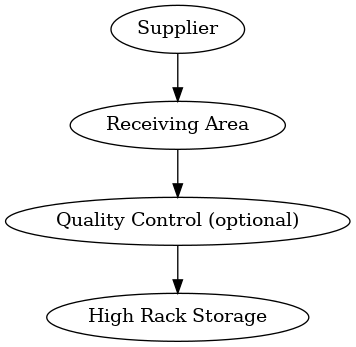
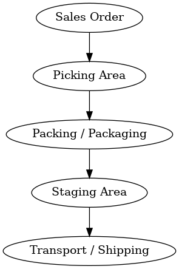

# 📦 SAP eWM Concept Project

  
  


Welcome to the **SAP Extended Warehouse Management (eWM) Process Simulation** project.

This repository presents a conceptual overview of typical warehouse processes modeled with SAP eWM terminology. Although it's not connected to a live SAP system, it demonstrates:

- Realistic warehouse operations based on industry practice (e.g., inbound, outbound, stock transfer)
- Mapping to eWM terms (storage bins, putaway, picking, etc.)
- Practical experience with SAP MM/WM and process logic

This project is especially useful for recruiters or hiring managers looking for candidates with warehouse operations experience who are transitioning into SAP eWM consulting.

🔗 [Zobacz wersję README po polsku](README_PL.md)

---

## 🧠 Goals of this Repository

- Showcase real warehouse/logistics knowledge based on 17+ years of practice
- Simulate SAP eWM flows and concepts using diagrams and documentation
- Prepare reusable resources for interviews or onboarding into SAP teams

---

## 🗂️ Repository Structure

| File / Folder              | Description                                     |
|---------------------------|-------------------------------------------------|
| `inbound-process.md`      | Describes how goods receipt works in eWM        |
| `outbound-process.md`     | Describes the picking and shipping process      |
| `stock-transfer.md`       | Simulates internal stock movements              |
| `storage-bins-layout.md`  | Describes layout and bin logic in a warehouse   |
| `sap-ewm-terminology.md`  | Dictionary of eWM terms and their usage         |
| `real-case-metal-transfer.md` | Realistic case study of controlled material flow |
| `example-documents/`      | Visual diagrams (draw.io or PNGs)               |

---

## 🚚 Sample Use Case: Medium-sized Industrial Warehouse

- 3 storage areas: Receiving → High-rack storage → Staging for outbound
- Multiple movement types (putaway, internal transfer, pick/pack)
- FIFO logic, inventory visibility, storage bin management

---
## 📊 Process Flow Diagrams

Below are simplified diagrams illustrating the inbound and outbound flows
as they are typically modeled in SAP eWM.

### 📦 Inbound & Outbound Flows

  
*Example of inbound process in SAP eWM*

### 🚚 Warehouse Process Visualization
  
*Example of outbound process in SAP eWM*

## 🧠 Run the Inbound Process Simulation

[](https://www.python.org/)  

This project includes a lightweight **SAP eWM inbound process simulator** written in Python.  
It reads simple YAML definitions and prints a realistic warehouse workflow log.

### 🔧 Run locally

```bash
# (optional) install YAML support
pip install pyyaml

# run the inbound simulation
python sap-ewm/simulate_inbound.py \
  --process sap-ewm/inbound_process.yaml \
  --event sap-ewm/samples/inbound_event.yaml \
  --bins sap-ewm/data/master_bins.yaml \
  --out sap-ewm/out/inbound_result.json
```

## 🎯 Why This Project Matters for Recruiters

- Demonstrates real SAP MM/WM/eWM process knowledge
- Shows ability to document and simulate warehouse flows
- Bridges SAP with modern IT/DevOps skills (cloud, automation)
- Ready-to-use resource for technical interviews

---

## 💻 Bonus – Technical Background

Alongside my SAP/logistics background, I also develop projects in cloud and DevOps technologies (AWS, Terraform, CI/CD, Docker). This strengthens my ability to:

- Automate and simulate warehouse processes with code
- Rapidly adapt to SAP-BTP, SAP on AWS, or hybrid IT/SAP environments
- Contribute to integration, testing, and technical documentation efforts

📂 Example DevOps Projects:  
➡️ [Security Alerting Pipeline (AWS + Terraform)](https://github.com/cloudcr0w/security-alerting-pipeline)  
➡️ [Sentiment Analyzer (FastAPI + EC2 + Docker)](https://github.com/cloudcr0w/sentiment-analyzer-devops)

---

## 🛣️ Next Steps (Roadmap)
- Add **Yard Management** example (doors, gates, TU assignment)
- Document **Wave Picking** and **Slotting** scenarios
- Provide example **Packaging Specification** and HU labeling
- Draft simple **integration note** for SAP on AWS / SAP BTP

---

## 📌 Author

**Adam Wrona** – 17 years of experience in industrial logistics and SAP MM operations (inventory transfers, storno, inter-plant movements). Now developing career in SAP eWM consulting with practical insight and technical skills.

🌐 [LinkedIn](https://www.linkedin.com/in/adam-wrona-111ba728b/) | [GitHub](https://github.com/cloudcr0w) | [Portfolio](https://www.crow-project.click)

---

_This project is not affiliated with or endorsed by SAP. It is a learning and demonstration resource._
