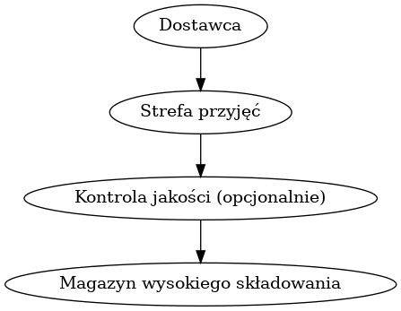
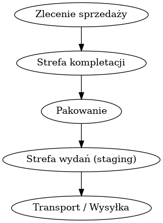

# 📦 SAP eWM – Koncepcyjny Projekt Logistyczny

  
  


Witaj w projekcie symulującym procesy magazynowe w SAP Extended Warehouse Management (eWM).

Ten projekt przedstawia koncepcyjne opracowanie typowych procesów magazynowych z wykorzystaniem terminologii i logiki SAP eWM. Choć nie jest to podpięte do prawdziwego systemu SAP, projekt demonstruje:

- Rzeczywiste operacje magazynowe na podstawie doświadczenia z przemysłu ciężkiego
- Mapowanie procesów na pojęcia SAP (storage bins, putaway, picking, itp.)
- Praktyczne wykorzystanie wiedzy z SAP MM/WM i logistyki operacyjnej

---

## 🎯 Cele projektu

- Pokazanie rzeczywistej wiedzy z zakresu logistyki magazynowej (17+ lat doświadczenia)
- Symulacja przepływów SAP eWM poprzez dokumentację i diagramy
- Materiał wspierający rozmowy rekrutacyjne i onboarding do projektów SAP

---

## 📁 Struktura repozytorium

| Plik / Folder                   | Opis                                                        |
|--------------------------------|-------------------------------------------------------------|
| `inbound-process.md`           | Opis procesu przyjęcia towaru w eWM                         |
| `outbound-process.md`          | Opis procesu kompletacji i wydania                          |
| `stock-transfer.md`            | Symulacja przesunięć wewnętrznych w magazynie               |
| `real-case-metal-transfer.md`  | Studium przypadku na bazie rzeczywistego procesu przemysłowego |
| `storage-bins-layout.md`       | Logika rozmieszczenia stref i adresów magazynowych          |
| `sap-ewm-terminology.md`       | Słowniczek podstawowych pojęć SAP eWM                       |
| `example-documents/`           | Diagramy, wizualizacje i pliki pomocnicze                   |

---

## 🏭 Scenariusz: średniej wielkości magazyn przemysłowy

- Strefy: Przyjęć (GR) → Kontrola Jakości → Magazyn wysokiego składowania → Strefa załadunku
- Ruchy: Putaway, picking, przesunięcia bin-to-bin, inspekcja
- FIFO, pełna identyfikowalność, obsługa partii

---

## 📊 Diagramy procesów

### Proces przyjęcia (Inbound)

  
*Przykład procesu przyjęcia dostawy w SAP eWM*

### Proces wydania (Outbound)

  
*Przykład procesu kompletacji i wysyłki w SAP eWM*

---

## 🧠 Uruchom symulację procesu przyjęcia towaru (Inbound)

[](https://www.python.org/)  

Projekt zawiera prosty **symulator procesu przyjęcia dostawy (SAP eWM)** napisany w Pythonie.  
Wykorzystuje pliki YAML do zdefiniowania kroków procesu i danych magazynowych, a następnie wyświetla szczegółowy log kroków.

### 🔧 Uruchomienie lokalne

```bash
# (opcjonalnie) instalacja obsługi YAML
pip install pyyaml

# uruchomienie symulacji
python sap-ewm/simulate_inbound.py \
  --process sap-ewm/inbound_process.yaml \
  --event sap-ewm/samples/inbound_event.yaml \
  --bins sap-ewm/data/master_bins.yaml \
  --out sap-ewm/out/inbound_result.json
  ```

## 🎯 Dlaczego ten projekt może być ważny dla rekruterów

- Pokazuje praktyczną wiedzę procesową SAP MM/WM/eWM
- Udowadnia umiejętność dokumentowania i symulowania procesów magazynowych
- Łączy SAP z nowoczesnym IT/DevOps (chmura, automatyzacja)
- Gotowy materiał do rozmów technicznych

---

## 🛠️ Tło techniczne

Poza doświadczeniem logistycznym rozwijam także projekty z zakresu DevOps i chmury (AWS, Terraform, CI/CD). To pozwala mi:

- Automatyzować i odwzorowywać procesy w formie kodu
- Łatwiej adaptować się do nowoczesnych środowisk (SAP-BTP, integracje SAP z chmurą)
- Usprawniać dokumentację techniczną i testowanie procesów

📂 Przykładowe projekty:  
➡️ [Security Alerting Pipeline (AWS + Terraform)](https://github.com/cloudcr0w/security-alerting-pipeline)  
➡️ [Sentiment Analyzer (FastAPI + EC2 + Docker)](https://github.com/cloudcr0w/sentiment-analyzer-devops)

---

## 🛣️ Co dalej (Roadmap)
- Dodać przykład **Yard Management** (bramy, doki, przypisanie pojazdów)
- Opisać **Wave Picking** i **Slotting**
- Dodać przykładową **Specyfikację pakowania** i etykietowanie HU
- Szkic **integracji SAP na AWS / SAP BTP**

---

## 📌 Autor

**Adam Wrona** – 17 lat doświadczenia w logistyce przemysłowej oraz pracy w SAP (MM, WM, obsługa partii, przesunięcia magazynowe, kontrola jakości). Obecnie rozwijam się jako konsultant SAP eWM i wdrażam wiedzę operacyjną w nowoczesne narzędzia
