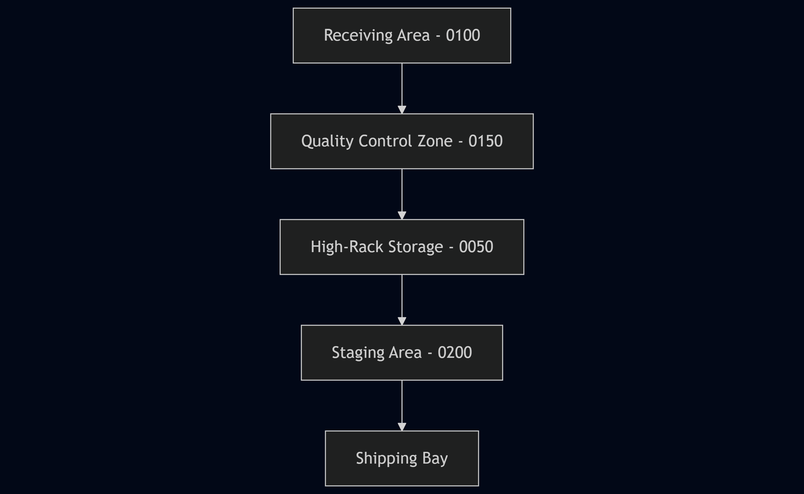

# 🏗️ Warehouse Layout and Storage Bin Logic – SAP eWM

This document describes a sample warehouse layout and bin logic structure used in SAP Extended Warehouse Management (eWM).

---

## 🖼️ Conceptual Layout (Visualized)

-
-
-
-*Sample layout showing the flow of goods: from Receiving through Quality Control, Storage, Staging, and finally Shipping.*
+## 🖼️ Conceptual Layout (Simplified)
+
+```text
+Receiving (0100) → Quality (0150) → High Rack (0050) → Staging (0200) → Shipping
+```
+
+*Simplified flow showing the main storage types used in the sample model.*

---

## 🧠 Example Strategies

- **Putaway (0100 → 0050):** FIFO, fixed bins for A-items, open-bin for B/C.
- **Picking (0050 → 0200):** Activity-area sequence, cluster picking for small picks.
- **QA Segregation (0150):** Stock type control; release to unrestricted after usage decision.


## 🧱 Storage Types and Example Bins

| Storage Type | Description                  | Example Bins        |
|--------------|------------------------------|---------------------|
| 0100         | Goods Receipt Zone           | GR01, GR02, GR03    |
| 0150         | Quality Inspection Zone      | QA01, QA02          |
| 0050         | High-Rack Storage            | BIN_A01 to BIN_A50  |
| 0200         | Outbound / Staging           | STG01, STG02        |

---

## 📌 Notes

- Storage types are logical sections in eWM that guide task creation and putaway strategies.
- Bin naming convention can follow zone and rack logic (e.g., BIN_A12 = Aisle A, Level 1, Position 2).
- Movement strategies (e.g. FIFO, fixed bin) are defined per storage type.

---


## 📎 See also
- [Inbound Process](inbound-process.md)
- [Outbound Process](outbound-process.md)
- [Stock Transfer](stock-transfer.md)
